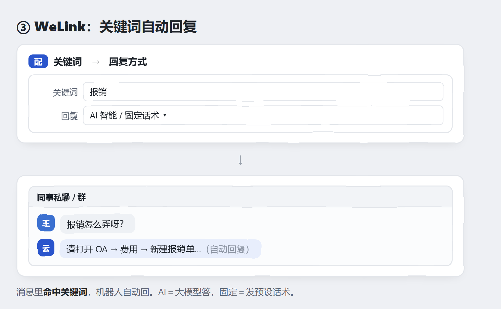

# 问题定位助手 · 用户手册

抓取本地 **Outlook 邮件** / **WeLink 群聊**，按规则匹配后归档为经验。
**在线**推送后端（OCR＋大模型整理、入库到团队知识库），**离线**只在本地产出 HTML＋Markdown。
Windows 单个 exe，双击即用，无需安装 Python。

> 看图就会用 👇

---

## 第一步：填一次配置

---

## 场景 ① · WeLink：把定位过程存成经验

先在软件里点「开始监听」，之后团队在 WeLink 群里排查。**三种方式任选其一**：

---

## 场景 ② · WeLink：关键词自动回复

---

## 场景 ③ · 邮件：自动归档

---

## 场景 ④ · 离线使用（不连服务器）

---

## 常见问题

| 问题 | 怎么办 |
|---|---|
| 文件夹列不出来 | 点文件夹面板「刷新」；确认 Outlook 已登录 |
| 定时同步没反应 | 确认已点击「启动定时」，并保持客户端运行 |
| 离线没生成文件 | 确认「保存目录」已填且有写权限 |
| 彻底退出 | 关闭客户端窗口并在确认框中选择退出 |

---

**用户手册及内源代码仓地址**：<https://openx.huawei.com/ProblemLocating/overview>

> 目录：`pyqt_client/` pywebview + WebView2 桌面客户端 · `server/` 后端服务（FastAPI）。
> 客户端打包：`cd pyqt_client && python build.py`（onefile 产物 `dist/问题定位助手.exe`）。
