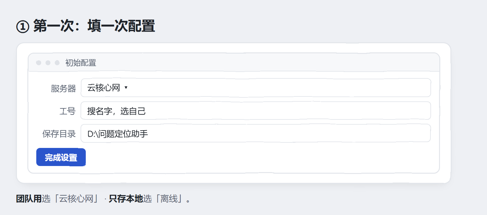
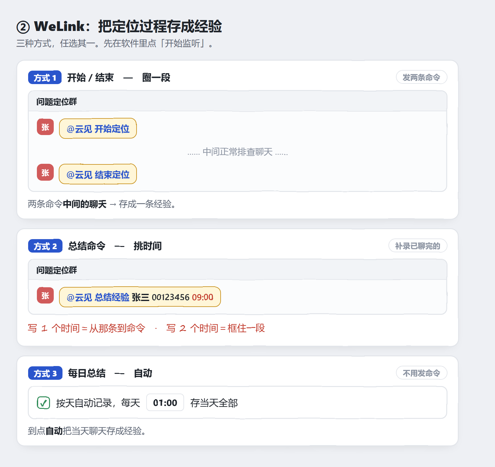
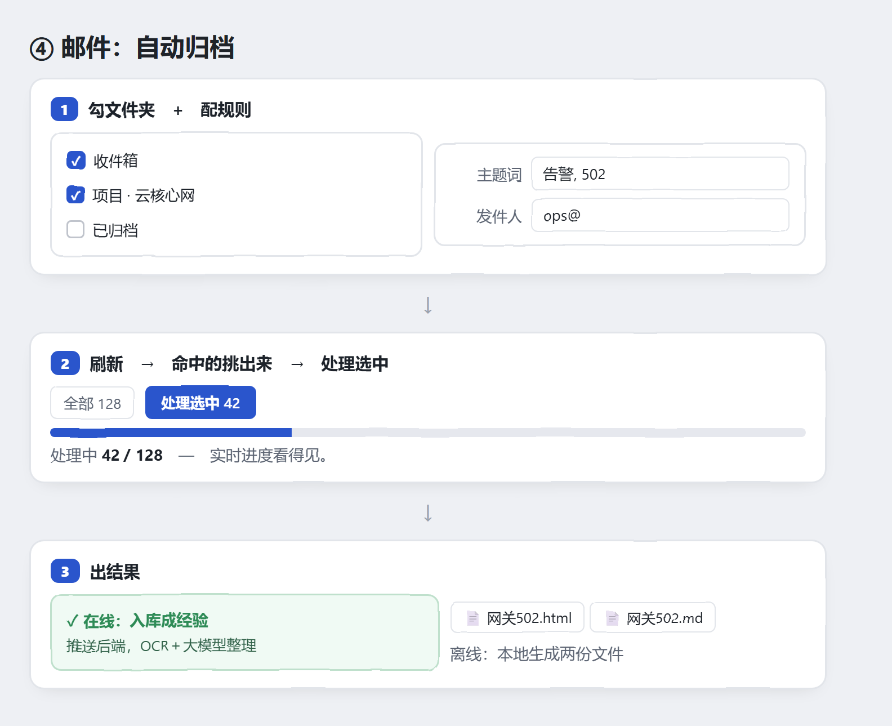
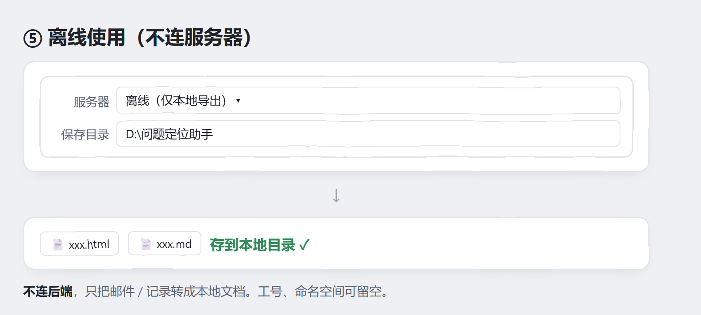

# CoreMiner · 用户手册

抓取本地 **Outlook 邮件** / **WeLink 群聊**，按规则匹配后归档为经验。
**在线**推送后端（OCR＋大模型整理、入库到团队知识库），**离线**只在本地产出 HTML＋Markdown。
Windows 单个 exe，双击即用，无需安装 Python。

> 看图就会用 👇

---

## 第一步：填一次配置

---

## 场景 ① · 聊天记录挖掘：把定位过程存成经验

添加 WeLink 群组或用户，按日期和时间范围分页获取完整历史聊天；可反选无关消息后手动处理，也可按来源启动增量或全量定时挖掘。

---

## 场景 ② · 邮件挖掘

---

## 场景 ③ · 离线使用（不连服务器）

---

## 常见问题

| 问题 | 怎么办 |
|---|---|
| 文件夹列不出来 | 点文件夹面板「刷新」；确认 Outlook 已登录 |
| 定时同步没反应 | 确认已点击「启动定时」；关闭窗口后程序会驻留系统托盘继续运行 |
| 离线没生成文件 | 确认「保存目录」已填且有写权限 |
| 彻底退出 | 右键系统托盘图标 → 退出（关闭窗口只是隐藏到托盘） |
| 查看运行日志 | 程序所在目录的 `log/app.log`；单文件 5 MB，最多 5 个备份，并自动清理 14 天前日志 |

---

**用户手册及内源代码仓地址**：<https://openx.huawei.com/ProblemLocating/overview>

> 目录：`pyqt_client/` pywebview + WebView2 桌面客户端 · `server/` 后端服务（FastAPI）。
> 客户端打包：`cd pyqt_client && python build.py`（onefile 产物 `dist/CoreMiner.exe`）。
